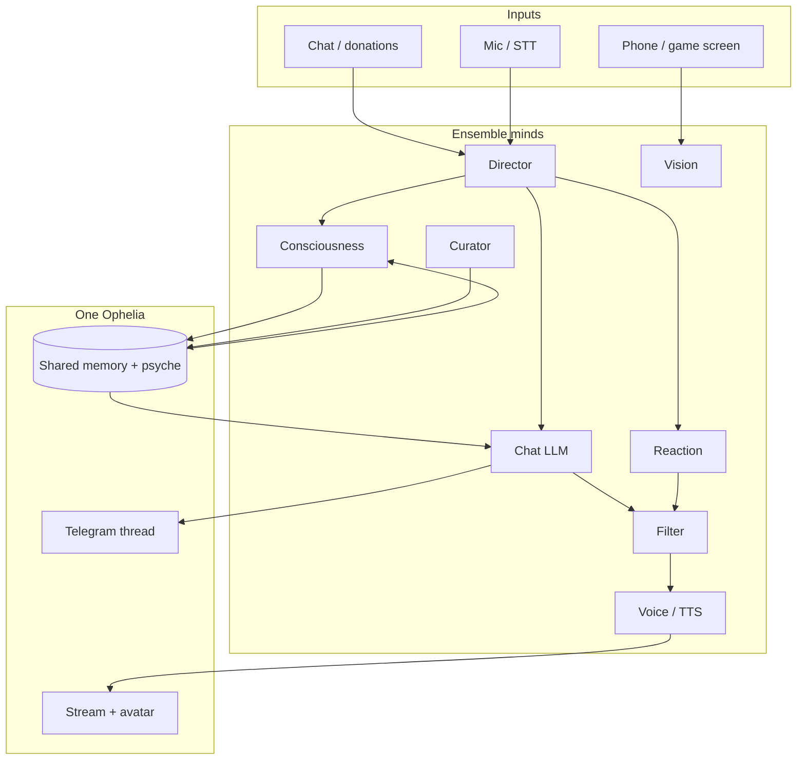

# Neuro-style ensemble (future)

Ophelia is being built toward a **multi-mind architecture** like Neuro-sama: not one monolithic model pretending to be a person, but **several specialized AIs** coordinated into a single character on stream.

This is **not active yet**. Today you get the first layer — separate models per *role* — with a **model gate** so only one loads at a time on local hardware. The ensemble doc is the roadmap for when you go live.

## Why multiple AIs

One model cannot do everything well at stream latency:

| Job | Needs |
|-----|--------|
| Banter with chat | Fast, persona-heavy, tool use |
| Inner life / initiative | Small model, always-on, JSON discipline |
| Screen / game reactions | Vision, low latency |
| Memory consolidation | Slow, factual, offline OK |
| Image / video bits | Heavy media models |
| Stream safety | Fast filter pass before TTS |
| Voice performance | Emotion / prosody separate from text gen |

Neuro feels like one person because a **director layer** picks which mind speaks, merges context, and enforces one outward voice — not because a single weights file does it all.

## What exists today (ensemble v0)

These are already separate **roles** in `ProviderStack` (`ophelia providers`):

```
chat           → outward voice (Telegram, stream chat)
consciousness  → inner ticks, drives, initiative
vision         → phone / game screen
curator        → long-term memory extraction
image          → still generation
video          → clip generation
```

Shared state today:

- **One SQLite memory** — all roles read/write the same conversation + psyche
- **Drives + mood** — consciousness updates; chat sees them in system context
- **Model gate** — one inference at a time (VRAM-safe until you have multi-GPU or cloud burst)

That is the skeleton of an ensemble: **many models, one Ophelia**.

## Planned minds (not implemented)

Future roles will extend beyond LLM chat. Names are tentative:

| Mind | Role id | Purpose |
|------|---------|---------|
| **Director** | `director` | Chooses which mind acts; stream pacing; "should I speak?" |
| **Voice** | `voice` | Text → speech script + emotion tags for TTS/avatar |
| **Filter** | `filter` | Pre-output moderation / tone check before stream |
| **Reaction** | `reaction` | Ultra-fast game/event responses (<500ms target) |
| **Avatar** | `avatar` | VTuber rig: expressions, lip sync, idle motion |
| **Music** | `music` | Singing / humming / song choice (specialized model or API) |

These will **not** each get a separate Telegram bot. They feed the same orchestrator and the same user-facing channel.

## Target architecture



## Hardware reality (why the model gate stays)

On a single GPU / phone:

- **One local model loaded at a time** — already enforced by `ModelGate`
- Director decides *priority*: live chat beats consciousness tick beats curator
- Cloud minds (xAI image/video, future hosted specialists) can run **in parallel** only when gate policy allows (separate from local VRAM)

When you scale to streaming PC + dedicated inference box, the gate can become **per-device** (local Ollama gate + cloud queue) without changing the role model.

## Config direction

Today:

```env
OPHELIA_PROVIDER_CHAT=ollama
OLLAMA_MODEL=llama3.2:3b
OLLAMA_CONSCIOUSNESS_MODEL=llama3.2:1b
OPHELIA_PROVIDER_VISION=ollama
OLLAMA_VISION_MODEL=llava:7b
OPHELIA_PROVIDER_IMAGE=xai-oauth
```

Future (example — not wired):

```env
# OPHELIA_PROVIDER_DIRECTOR=ollama
# OLLAMA_DIRECTOR_MODEL=llama3.2:1b
# OPHELIA_PROVIDER_FILTER=ollama
# OPHELIA_PROVIDER_REACTION=ollama
# OLLAMA_REACTION_MODEL=llama3.2:1b
# OPHELIA_ENSEMBLE_ENABLED=true
```

Role env pattern stays the same: `OPHELIA_PROVIDER_<ROLE>` + model env per backend.

## Training path

Multi-mind makes **fine-tuning easier**:

- Chat model ← stream transcripts + persona
- Consciousness ← inner monologue log (`~/.ophelia/data/inner_monologue.md`)
- Reaction ← game clips + labeled moments
- Filter ← your moderation policy examples

Each mind gets its own dataset; director learns routing from session logs.

## Implementation order (when you start)

1. **Director** — priority queue over model gate; stream mode flag
2. **Filter** — cheap pass on outbound text before Telegram/TTS
3. **Reaction** — small fast model + vision hooks for games
4. **Voice mind** — decouple TTS emotion from chat LLM
5. **Avatar bridge** — VTube Studio / similar via MCP or custom tool

Code stub for planned roles: `src/ophelia/mind/ensemble.py` (types only until ensemble is enabled).

See also: [local-first.md](local-first.md), [tier1-setup.md](tier1-setup.md), [pc-ui.md](pc-ui.md).
